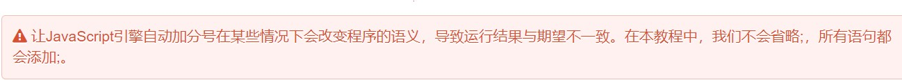
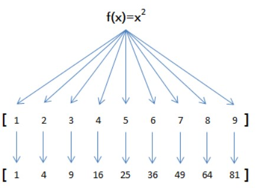

# JavaScript是世界上最流行的脚本语言

## 电脑手机平板上的网页以及无数基于HTML5的手机APP，交互逻辑都是由JavaScript驱动的。


简单地说，JavaScript是一种运行在浏览器中的解释型的编程语言。
那么问题来了，为什么我们要学JavaScript？尤其是当你已经掌握了某些其他编程语言如Java、C++的情况下。
简单粗暴的回答就是：因为你没有选择。在Web世界里，只有JavaScript能跨平台、跨浏览器驱动网页，与用户交互。

Flash背后的ActionScript曾经流行过一阵子，不过随着移动应用的兴起，没有人用Flash开发手机App，所以它目前已经边缘化了。相反，随着HTML5在PC和移动端越来越流行，JavaScript变得更加重要了。并且，新兴的Node.js把JavaScript引入到了服务器端，JavaScript已经变成了全能型选手。


## JavaScript历史
要了解JavaScript，我们首先要回顾一下JavaScript的诞生。

在上个世纪的1995年，当时的网景公司正凭借其Navigator浏览器成为Web时代开启时最著名的第一代互联网公司。

由于网景公司希望能在静态HTML页面上添加一些动态效果，于是叫Brendan Eich这哥们在两周之内设计出了JavaScript语言。你没看错，这哥们只用了10天时间。

为什么起名叫JavaScript？原因是当时Java语言非常红火，所以网景公司希望借Java的名气来推广，但事实上JavaScript除了语法上有点像Java，其他部分基本上没啥关系。

## ECMAScript
因为网景开发了JavaScript，一年后微软又模仿JavaScript开发了JScript，为了让JavaScript成为全球标准，几个公司联合ECMA（European Computer Manufacturers Association）组织定制了JavaScript语言的标准，被称为ECMAScript标准。

所以简单说来就是，ECMAScript是一种语言标准，而JavaScript是网景公司对ECMAScript标准的一种实现。

那为什么不直接把JavaScript定为标准呢？因为JavaScript是网景的注册商标。

不过大多数时候，我们还是用JavaScript这个词。如果你遇到ECMAScript这个词，简单把它替换为JavaScript就行了。

## JavaScript版本
JavaScript语言是在10天时间内设计出来的，虽然语言的设计者水平非常NB，但谁也架不住“时间紧，任务重”，所以，JavaScript有很多设计缺陷，我们后面会慢慢讲到。

此外，由于JavaScript的标准——ECMAScript在不断发展，最新版ECMAScript 6标准（简称ES6）已经在2015年6月正式发布了，所以，讲到JavaScript的版本，实际上就是说它实现了ECMAScript标准的哪个版本。

由于浏览器在发布时就确定了JavaScript的版本，加上很多用户还在使用IE6这种古老的浏览器，这就导致你在写JavaScript的时候，要照顾一下老用户，不能一上来就用最新的ES6标准写，否则，老用户的浏览器是无法运行新版本的JavaScript代码的。

不过，JavaScript的核心语法并没有多大变化。我们的教程会先讲JavaScript最核心的用法，然后，针对ES6讲解新增特性。


JavaScript代码可以直接嵌在网页的任何地方，不过通常我们都把JavaScript代码放到<head>中：

```html
<html>
<head>
  <script>
    alert('Hello, world');
  </script>
</head>
<body>
</body>
</html>

```


由``<script>...</script>``包含的代码就是JavaScript代码，它将直接被浏览器执行。

第二种方法是把JavaScript代码放到一个单独的.js文件，然后在HTML中通过<script src="..."></script>引入这个文件：


```html
<html>
<head>
  <script src="/js/hello.js"></script>
</head>
<body>
</body>
</html>
```


## 调试
俗话说得好，“工欲善其事，必先利其器。”，写JavaScript的时候，如果期望显示ABC，结果却显示XYZ，到底代码哪里出了问题？不要抓狂，也不要泄气，作为小白，要坚信：JavaScript本身没有问题，浏览器执行也没有问题，有问题的一定是我的代码。

如何找出问题代码？这就需要调试。

怎么在浏览器中调试JavaScript代码呢？

首先，你需要安装Google Chrome浏览器，Chrome浏览器对开发者非常友好，可以让你方便地调试JavaScript代码。从这里下载Chrome浏览器。打开网页出问题的童鞋请移步国内镜像。

安装后，随便打开一个网页，然后点击菜单“查看(View)”-“开发者(Developer)”-“开发者工具(Developer Tools)”，浏览器窗口就会一分为二，下方就是开发者工具：


如果你对自己还有更高的要求，可以研究开发者工具的“源码(Sources)”，掌握断点、单步执行等高级调试技巧。


## 基本语法

JavaScript的语法和Java语言类似，每个语句用``;``结束，语句块用``{.........}``


但是浏览器中负责执行JavaScript代码的引擎会自动在每个语句上补上``;``。


再但是



### 基本语句
```js
var x = 1;//完整的赋值语句


'hello,word';//就是一个字符串，但也可以视为一个语句


var x = 1; var y = 2;//一行包含两个语句，每个语句以;表示语句结束，是合法的。 
//但是并不建议！！

/*语句块是一组语句的集合，例如这段语句，先执行(...)内的判断，成立就执行{....}中的所有语句*/

if(2>1){
    x = 1;
    y = 2;
    z = 3;
}

//花括号语句都有缩进，相当于四个空格，不是语法要求，但是有助于我们理解代码
//{.....}还可以进行多重嵌套

//JavaScript本身对嵌套的层级没有限制，但是过多的嵌套无疑会大大增加看懂代码的难度。遇到这种情况，需要把部分代码抽出来，作为函数来调用，这样可以减少代码的复杂度。

//注释符号与C++相同

//还有JavaScript严格区分大小写，如果弄错了大小写，程序将报错或者运行不正常。


```


### 数据类型

#### Number 

javaScript不区分整数和浮点数，统一用Number表示，以下都是合法的Number类型：
```js
123; // 整数123
0.456; // 浮点数0.456
1.2345e3; // 科学计数法表示1.2345x1000，等同于1234.5
-99; // 负数
NaN; // NaN表示Not a Number，当无法计算结果时用NaN表示
Infinity; // Infinity表示无限大，当数值超过了JavaScript的Number所能表示的最大值时，就表示为Infinity
```
数值运算符号都与C++类似 + - * / %
```JS
1 + 2; // 3
(1 + 2) * 5 / 2; // 7.5
2 / 0; // Infinity
0 / 0; // NaN
10 % 3; // 1
10.5 % 3; // 1.5
```

#### 字符串
``''``或者``""``都无所谓
``\``表示转义
##### 多行字符串
由于多行字符串用\n写起来比较费事，所以最新的ES6标准新增了一种多行字符串的表示方法，用反引号`` ` ``表示：
```js
`多行
字符串
测试`;//就是将字符串用`包裹起来
```
##### 模板字符串
字符串连接可以用+号
```js
var name = '小明';
var age = 20;
var message = '你好, ' + name + ', 你今年' + age + '岁了!';
alert(message);
```


如果变量很多+号很麻烦。因此ES6新增了一种模板字符串，表示方法和上面的多行字符串一样，但是它会自动替换字符串中的变量：
```JS
var name = '小明';
var age = 20;
var message = `你好, ${name}, 你今年${age}岁了!`;
alert(message);
```


##### 操作字符串
```JS
var s = 'Hello, world!';
s.length;
s[0];'H'
s[0]=x;//是无用操作，字符串是不可变的
//JavaScript为字符串提供了一些常用方法，注意，调用这些方法本身不会改变原有字符串的内容，而是返回一个新字符串 
//toUpperCase toLowerCase indexOf substring
```


#### 布尔值
``true``或``false``  ?0==false 1==true 
bool运算符 ``&&`` ``||`` ``!``
比较运算符 ``>`` ``<`` ``==`` ``===``

JavaScript把null、undefined、0、NaN和空字符串''视为false，其他值一概视为true，因此上述代码条件判断的结果是true。

##### 重点  
第一种是==比较，它会自动转换数据类型再比较，很多时候，会得到非常诡异的结果；

第二种是===比较，它不会自动转换数据类型，如果数据类型不一致，返回false，如果一致，再比较。

由于JavaScript这个设计缺陷，不要使用==比较，始终坚持使用```===```比较。

另一个例外是NaN这个特殊的Number与所有其他值都不相等，包括它自己：
```js 
NaN === NaN; // false
```

唯一能够判断``NaN``的方法是通过isNaN()函数:

``isNaN(NaN);//true``


最后还要注意浮点数的相等比较

``1/3 === (1-2/3);//false``

这不是JavaScript的设计缺陷。<br>
浮点数在运算过程中会产生误差，因为计算机无法精确表示无限循环小数。要比较两个浮点数是否相等，只能计算它们之差的绝对值，看是否小于某个阈值：

``Math.abs(1 / 3 - (1 - 2 / 3)) < 0.0000001; // true``


#### null and undefined

``null``表示一个"空"的值 它不俗hi``0``也不是``''``。``0``是一个数值，``''``表示长度为0的字符串，而``null``表示“空”。<br>
在其他语言中，也有类似JavaScript的null的表示，例如Java也用null，Swift用nil，Python用None表示。<br>
但是，在JavaScript中，还有一个和``null``类似的``undefined``，它表示“未定义”。
<br>
JavaScript的设计者希望用null表示一个空的值，而undefined表示值未定义。事实证明，这并没有什么卵用，区分两者的意义不大。大多数情况下，我们都应该用null。undefined仅仅在判断函数参数是否传递的情况下有用。
<br>


#### 数组

JavaScript的数组可以包括任意数据类型。
```JS
var arr = [1, 2, 3.14, 'Hello', null, true];
//也可以
var arr = new Array(1, 2, 3); 
//然而，出于代码的可读性考虑，强烈建议直接使用[]。
```


##### length
```JS
var arr = [1, 2, 3];
arr.length; // 3
arr.length = 6;
arr; // arr变为[1, 2, 3, undefined, undefined, undefined]
arr.length = 2;
arr; // arr变为[1, 2]


var arr = [1, 2, 3];
arr[5] = 'x';
arr; // arr变为[1, 2, 3, undefined, undefined, 'x']
```
直接给Array的length赋一个新的值会导致Array大小的变化：  
如果通过索引赋值时，索引超过了范围，同样会引起Array大小的变化：  
大多数其他编程语言不允许直接改变数组的大小，越界访问索引会报错。  
然而，JavaScript的Array却不会有任何错误。在编写代码时，不建议直接修改Array的大小，访问索引时要确保索引不会越界。

##### indexOf
```JS
var arr = [10, 20, '30', 'xyz'];
arr.indexOf(10); // 元素10的索引为0
arr.indexOf(20); // 元素20的索引为1
arr.indexOf(30); // 元素30没有找到，返回-1
arr.indexOf('30'); // 元素'30'的索引为2  注意了，数字30和字符串'30'是不同的元素。

```


##### slice
slice()就是对应String的substring()版本，它截取Array的部分元素，然后返回一个新的Array
```JS
var arr = ['A', 'B', 'C', 'D', 'E', 'F', 'G'];
arr.slice(0, 3); // 从索引0开始，到索引3结束，但不包括索引3: ['A', 'B', 'C']
arr.slice(3); // 从索引3开始到结束: ['D', 'E', 'F', 'G']
//注意到slice()的起止参数包括开始索引，不包括结束索引。

///如果不给slice()传递任何参数，它就会从头到尾截取所有元素。利用这一点，我们可以很容易地复制一个Array：
var arr = ['A', 'B', 'C', 'D', 'E', 'F', 'G'];
var aCopy = arr.slice();
aCopy; // ['A', 'B', 'C', 'D', 'E', 'F', 'G']
aCopy === arr; // false
```


##### push和pop
push()向Array的末尾添加若干元素，pop()则把Array的最后一个元素删除掉：
```JS
var arr = [1, 2];
arr.push('A', 'B'); // 返回Array新的长度: 4
arr; // [1, 2, 'A', 'B']
arr.pop(); // pop()返回'B'
arr; // [1, 2, 'A']
arr.pop(); arr.pop(); arr.pop(); // 连续pop 3次
arr; // []
arr.pop(); // 空数组继续pop不会报错，而是返回undefined
arr; // []
```


##### unshift和shift
如果要往Array的头部添加若干元素，使用unshift()方法，shift()方法则把Array的第一个元素删掉：
```JS
var arr = [1, 2];
arr.unshift('A', 'B'); // 返回Array新的长度: 4
arr; // ['A', 'B', 1, 2]
arr.shift(); // 'A'
arr; // ['B', 1, 2]
arr.shift(); arr.shift(); arr.shift(); // 连续shift 3次
arr; // []
arr.shift(); // 空数组继续shift不会报错，而是返回undefined
arr; // []
```

##### sort
sort()可以对当前Array进行排序，它会直接修改当前Array的元素位置，直接调用时，按照默认顺序排序：
```JS
var arr = ['B', 'C', 'A'];
arr.sort();
arr; // ['A', 'B', 'C']
能否按照我们自己指定的顺序排序呢？完全可以，我们将在后面的函数中讲到。
```


##### reverse
reverse()把整个Array的元素给调个个，也就是反转
```JS
var arr = ['one', 'two', 'three'];
arr.reverse(); 
arr; // ['three', 'two', 'one']
```


##### splice
splice()方法是修改Array的“万能方法”，它可以从指定的索引开始删除若干元素，然后再从该位置添加若干元素：
```JS
var arr = ['Microsoft', 'Apple', 'Yahoo', 'AOL', 'Excite', 'Oracle'];
// 从索引2开始删除3个元素,然后再添加两个元素:
arr.splice(2, 3, 'Google', 'Facebook'); // 返回删除的元素 ['Yahoo', 'AOL', 'Excite']
arr; // ['Microsoft', 'Apple', 'Google', 'Facebook', 'Oracle']
// 只删除,不添加:
arr.splice(2, 2); // ['Google', 'Facebook']
arr; // ['Microsoft', 'Apple', 'Oracle']
// 只添加,不删除:
arr.splice(2, 0, 'Google', 'Facebook'); // 返回[],因为没有删除任何元素
arr; // ['Microsoft', 'Apple', 'Google', 'Facebook', 'Oracle']
```


##### concat
concat()方法把当前的Array和另一个Array连接起来，并返回一个新的Array：
```JS
var arr = ['A', 'B', 'C'];
var added = arr.concat([1, 2, 3]);
added; // ['A', 'B', 'C', 1, 2, 3]
arr; // ['A', 'B', 'C']
//请注意，concat()方法并没有修改当前Array，而是返回了一个新的Array。

//实际上，concat()方法可以接收任意个元素和Array，并且自动把Array拆开，然后全部添加到新的Array里：

var arr = ['A', 'B', 'C'];
arr.concat(1, 2, [3, 4]); // ['A', 'B', 'C', 1, 2, 3, 4]
```

##### join
join()方法是一个非常实用的方法，它把当前Array的每个元素都用指定的字符串连接起来，然后返回连接后的字符串：
```JS
var arr = ['A', 'B', 'C', 1, 2, 3];
arr.join('-'); // 'A-B-C-1-2-3'
// 如果Array的元素不是字符串，将自动转换为字符串后再连接。
```


##### 多维数组
##### 对象

javaScript的对象是一组由键-值组成的无序集合

```js
var person = {
    name: 'Bob',
    age: 20,
    tags: ['js', 'web', 'mobile'],
    city: 'Beijing',
    hasCar: true,
    zipcode: null
};
```
avaScript对象的键都是字符串类型，值可以是任意数据类型。上述person对象一共定义了6个键值对，其中每个键又称为对象的属性，例如，person的name属性为'Bob'，zipcode属性为null。
<br><br>
JavaScript用一个{...}表示一个对象，键值对以xxx: xxx形式申明，用,隔开。注意，最后一个键值对不需要在末尾加,，如果加了，有的浏览器（如低版本的IE）将报错。  


访问属性是通过.操作符完成的，但这要求属性名必须是一个有效的变量名。如果属性名包含特殊字符，就必须用''括起来：
```JS
var xiaohong = {
    name: '小红',
    'middle-school': 'No.1 Middle School'
};
// xiaohong的属性名middle-school不是一个有效的变量，就需要用''括起来。访问这个属性也无法使用.操作符，必须用['xxx']来访问：

xiaohong['middle-school']; // 'No.1 Middle School'
xiaohong['name']; // '小红'
xiaohong.name; // '小红'

// 也可以用xiaohong['name']来访问xiaohong的name属性，不过xiaohong.name的写法更简洁。
// 我们在编写JavaScript代码的时候，属性名尽量使用标准的变量名，这样就可以直接通过object.prop的形式访问一个属性了。

// 实际上JavaScript对象的所有属性都是字符串，不过属性对应的值可以是任意数据类型。
```

由于JavaScript的对象是动态类型，你可以自由地给一个对象添加或删除属性：
```js
var xiaoming = {
    name: '小明'
};
xiaoming.age; // undefined
xiaoming.age = 18; // 新增一个age属性
xiaoming.age; // 18
delete xiaoming.age; // 删除age属性
xiaoming.age; // undefined
delete xiaoming['name']; // 删除name属性
xiaoming.name; // undefined
delete xiaoming.school; // 删除一个不存在的school属性也不会报错

```

如果我们要检测xiaoming是否拥有某一属性，可以用in操作符：
```JS
var xiaoming = {
    name: '小明',
    birth: 1990,
    school: 'No.1 Middle School',
    height: 1.70,
    weight: 65,
    score: null
};
'name' in xiaoming; // true
'grade' in xiaoming; // false
// 不过要小心，如果in判断一个属性存在，这个属性不一定是xiaoming的，它可能是xiaoming继承得到的：

'toString' in xiaoming; // true
// 因为toString定义在object对象中，而所有对象最终都会在原型链上指向object，所以xiaoming也拥有toString属性。

// 要判断一个属性是否是xiaoming自身拥有的，而不是继承得到的，可以用hasOwnProperty()方法：

var xiaoming = {
    name: '小明'
};
xiaoming.hasOwnProperty('name'); // true
xiaoming.hasOwnProperty('toString'); // false
```

####变量

strict模式
JavaScript在设计之初，为了方便初学者学习，并不强制要求用var申明变量。这个设计错误带来了严重的后果：如果一个变量没有通过var申明就被使用，那么该变量就自动被申明为全局变量：  
为了修补JavaScript这一严重设计缺陷，ECMA在后续规范中推出了strict模式，在strict模式下运行的JavaScript代码，强制通过var申明变量，未使用var申明变量就使用的，将导致运行错误。
启用strict模式的方法是在JavaScript代码的第一行写上：  
```js
'use strict';
```

##### 不用var申明的变量会被视为全局变量，为了避免这一缺陷，所有的JavaScript代码都应该使用strict模式。我们在后面编写的JavaScript代码将全部采用strict模式。


#### 循环
普通的for,while,do while就不说了
##### for ... in
for循环的一个变体是for ... in循环，它可以把一个对象的所有属性依次循环出来：
##### iterable(迭代器)  循环最好都使用迭代器
遍历Array可以采用下标循环，遍历Map和Set就无法使用下标。为了统一集合类型，ES6标准引入了新的iterable类型，Array、Map和Set都属于iterable类型。

具有iterable类型的集合可以通过新的for ... of循环来遍历。
```JS
'use strict';
var a = [1, 2, 3];
for (var x of a) {
}
console.log('你的浏览器支持for ... of');

// 你可能会有疑问，for ... of循环和for ... in循环有何区别？

// for ... in循环由于历史遗留问题，它遍历的实际上是对象的属性名称。一个Array数组实际上也是一个对象，它的每个元素的索引被视为一个属性。

// 当我们手动给Array对象添加了额外的属性后，for ... in循环将带来意想不到的意外效果：

var a = ['A', 'B', 'C'];
a.name = 'Hello';
for (var x in a) {
    console.log(x); // '0', '1', '2', 'name'
}
// for ... in循环将把name包括在内，但Array的length属性却不包括在内。

// for ... of循环则完全修复了这些问题，它只循环集合本身的元素：

// 这就是为什么要引入新的for ... of循环。

// 然而，更好的方式是直接使用iterable内置的forEach方法，它接收一个函数，每次迭代就自动回调该函数。

a.forEach(function (element, index, array) {
    // element: 指向当前元素的值
    // index: 指向当前索引
    // array: 指向Array对象本身
    console.log(element + ', index = ' + index);
});
// 注意，forEach()方法是ES5.1标准引入的，你需要测试浏览器是否支持。

// Set与Array类似，但Set没有索引，因此回调函数的前两个参数都是元素本身：
// Map的回调函数参数依次为value、key和map本身：


// 如果对某些参数不感兴趣，由于JavaScript的函数调用不要求参数必须一致，因此可以忽略它们。例如，只需要获得Array的element：

var a = ['A', 'B', 'C'];
a.forEach(function (element) {
    console.log(element);
});

```


#### Map and Set
Map和对象的区别就是它的键的类型可以是number和其他数据类型
```JS
var m = new Map([['Michael', 95], ['Bob', 75], ['Tracy', 85]]);
m.get('Michael'); // 95
// 初始化Map需要一个二维数组，或者直接初始化一个空Map。Map具有以下方法：
var m = new Map(); // 空Map
m.set('Adam', 67); // 添加新的key-value
m.set('Bob', 59);
m.has('Adam'); // 是否存在key 'Adam': true
m.get('Adam'); // 67
m.delete('Adam'); // 删除key 'Adam'
m.get('Adam'); // undefined
//  由于一个key只能对应一个value，所以，多次对一个key放入value，后面的值会把前面的值冲掉：
var m = new Map();
m.set('Adam', 67);
m.set('Adam', 88);
m.get('Adam'); // 88


```


#### Set
Set和Map类似，也是一组key的集合，但不存储value。由于key不能重复，所以，在Set中，没有重复的key。
```JS
// 要创建一个Set，需要提供一个Array作为输入，或者直接创建一个空Set：
var s1 = new Set(); // 空Set
var s2 = new Set([1, 2, 3]); // 含1, 2, 3
// 重复元素在Set中自动被过滤：

var s = new Set([1, 2, 3, 3, '3']);
s; // Set {1, 2, 3, "3"}
// 注意数字3和字符串'3'是不同的元素。

// 通过add(key)方法可以添加元素到Set中，可以重复添加，但不会有效果：

s.add(4);
s; // Set {1, 2, 3, 4}
s.add(4);
s; // 仍然是 Set {1, 2, 3, 4}
// 通过delete(key)方法可以删除元素：

var s = new Set([1, 2, 3]);
s; // Set {1, 2, 3}
s.delete(3);
s; // Set {1, 2}
```

######  可参考https://www.cnblogs.com/onepixel/p/7337248.html
#### null
null 的字面意思是：空值  。这个值的语义是，希望表示 一个对象被人为的重置为空对象，而非一个变量最原始的状态 。<br> 在内存里的表示就是，栈中的变量没有指向堆中的内存对象，即：
当一个对象被赋值了null 以后，原来的对象在内存中就处于游离状态，GC 会择机回收该对象并释放内存。<br>因此，如果需要释放某个对象，就将变量设置为 null，即表示该对象已经被清空，目前无效状态。试想一下，如果此处把 null 换成 undefined 会不会感到别扭? 显然语义不通，其操作不能正确的表达其想要的行为。<br><br>
null 有属于自己的类型 Null，而不属于Object类型，typeof 之所以会判定为 Object 类型``if(typeof(null) === 'object') console.log("aaaaa");``是因为JavaScript 数据类型在底层都是以二进制的形式表示的，二进制的前三位为 0 会被 typeof 判断为对象类型，而 null 的二进制位恰好都是 0 ，因此，null 被误判断为 Object 类型。<br><br>
000 - 对象，数据是对象的应用<br><br>

1 - 整型，数据是31位带符号整数

010 - 双精度类型，数据是双精度数字

100 - 字符串，数据是字符串

110 - 布尔类型，数据是布尔值
<br><br>

#### 什么是``undefined``
【1】声明了一个变量，但没有赋值
```JS
var foo;
console.log(foo); // undefined
```
访问 foo，返回了 undefined，表示这个变量自从声明了以后，就从来没有使用过，也没有定义过任何有效的值，即处于一种原始而不可用的状态。

【2】访问对象上不存在的属性 
```js
console.log(Object.foo); // undefined
var arr = [];
console.log([0]); // undefined
```
访问 Object 对象上的 foo 属性，返回 undefined ， 表示Object 上不存在或者没有定义名为 foo 的属性。数组中的元素在内部也属于对象属性，访问下标就等于访问这个属性，返回 undefined ，就表示数组中不存在这个元素。

【3】函数定义了形参，但没有传递实参
```js
//函数定义了形参 a
function fn(a) {
    console.log(a); // undefined
}
fn(); //未传递实参
```
函数 fn 定义了形参 a， 但 fn 被调用时没有传递参数，因此，fn 运行时的参数 a 就是一个原始的、未被赋值的变量。

【4】使用 void 对表达式求值
```js
void 0 ; // undefined
void false; // undefined
void[]; // undefined
void null; // undefined
void function fn(){} ; // undefined
```


### 函数
在JavaScript中，定义函数的方式如下：
```JS
function abs(x) {
    if (x >= 0) {
        return x;
    } else {
        return -x;
    }
}
```
由于JavaScript的函数也是一个对象，上述定义的abs()函数实际上是一个函数对象，而函数名abs可以视为指向该函数的变量。
```JS
var abs = function (x) {
    if (x >= 0) {
        return x;
    } else {
        return -x;
    }
};
// 在这种方式下，function (x) { ... }是一个匿名函数，它没有函数名。但是，这个匿名函数赋值给了变量abs，所以，通过变量abs就可以调用该函数。

// 上述两种定义完全等价，注意第二种方式按照完整语法需要在函数体末尾加一个;，表示赋值语句结束。
```

#### 调用函数
```JS
// 调用函数时，按顺序传入参数即可：

abs(10); // 返回10
abs(-9); // 返回9
// 由于JavaScript允许传入任意个参数而不影响调用，因此传入的参数比定义的参数多也没有问题，虽然函数内部并不需要这些参数：

abs(10, 'blablabla'); // 返回10
abs(-9, 'haha', 'hehe', null); // 返回9
// 传入的参数比定义的少也没有问题：

abs(); // 返回NaN
// 此时abs(x)函数的参数x将收到undefined，计算结果为NaN。

// 要避免收到undefined，可以对参数进行检查：

function abs(x) {
    if (typeof x !== 'number') {
        throw 'Not a number';
    }
    if (x >= 0) {
        return x;
    } else {
        return -x;
    }
}
```

#### arguments
avaScript还有一个免费赠送的关键字arguments，它只在函数内部起作用，并且永远指向当前函数的调用者传入的所有参数。arguments类似Array但它不是一个Array
```JS
function foo(x) {
    console.log('x = ' + x); // 10
    for (var i=0; i<arguments.length; i++) {
        console.log('arg ' + i + ' = ' + arguments[i]); // 10, 20, 30
    }
}
foo(10, 20, 30);
// 利用arguments，你可以获得调用者传入的所有参数。也就是说，即使函数不定义任何参数，还是可以拿到参数的值：

// 实际上arguments最常用于判断传入参数的个数。你可能会看到这样的写法：

// foo(a[, b], c)
// 接收2~3个参数，b是可选参数，如果只传2个参数，b默认为null：
function foo(a, b, c) {
    if (arguments.length === 2) {
        // 实际拿到的参数是a和b，c为undefined
        c = b; // 把b赋给c
        b = null; // b变为默认值
    }
    // ...
}
// 要把中间的参数b变为“可选”参数，就只能通过arguments判断，然后重新调整参数并赋值


// 实际上arguments最常用于判断传入参数的个数。你可能会看到这样的写法：

// foo(a[, b], c)
// 接收2~3个参数，b是可选参数，如果只传2个参数，b默认为null：
function foo(a, b, c) {
    if (arguments.length === 2) {
        // 实际拿到的参数是a和b，c为undefined
        c = b; // 把b赋给c
        b = null; // b变为默认值
    }
    // ...
}
// 要把中间的参数b变为“可选”参数，就只能通过arguments判断，然后重新调整参数并赋值。。
```
https://developer.mozilla.org/zh-CN/docs/Web/JavaScript/Reference/Functions/arguments

由于JavaScript函数允许接收任意个参数，于是我们就不得不用arguments来获取所有参数：

##### rest
用于接受多余参数
```JS
function foo(a, b) {
    var i, rest = [];
    if (arguments.length > 2) {
        for (i = 2; i<arguments.length; i++) {
            rest.push(arguments[i]);
        }
    }
    console.log('a = ' + a);
    console.log('b = ' + b);
    console.log(rest);
}

function foo(a, b, ...rest) {
    console.log('a = ' + a);
    console.log('b = ' + b);
    console.log(rest);
}

foo(1, 2, 3, 4, 5);
// 结果:
// a = 1
// b = 2
// Array [ 3, 4, 5 ]

foo(1);
// 结果:
// a = 1
// b = undefined
// Array []


// rest参数只能写在最后，前面用...标识，从运行结果可知，传入的参数先绑定a、b，多余的参数以数组形式交给变量rest，所以，不再需要arguments我们就获取了全部参数。

// 如果传入的参数连正常定义的参数都没填满，也不要紧，rest参数会接收一个空数组（注意不是undefined）。
```


##### return
小心你的return语句
前面我们讲到了JavaScript引擎有一个在行末自动添加分号的机制，这可能让你栽到return语句的一个大坑：
```JS
function foo() {
    return { name: 'foo' };
}

foo(); // { name: 'foo' }
如果把return语句拆成两行：

function foo() {
    return
        { name: 'foo' };
}

foo(); // undefined
要小心了，由于JavaScript引擎在行末自动添加分号的机制，上面的代码实际上变成了：

function foo() {
    return; // 自动添加了分号，相当于return undefined;
        { name: 'foo' }; // 这行语句已经没法执行到了
}
所以正确的多行写法是：

function foo() {
    return { // 这里不会自动加分号，因为{表示语句尚未结束
        name: 'foo'
    };
}
```

#### 变量作用域

如果两个不同的函数各自申明了同一个变量，那么该变量只在各自的函数体内起作用。换句话说，不同函数内部的同名变量互相独立，互不影响：


由于JavaScript的函数可以嵌套，此时，内部函数可以访问外部函数定义的变量，反过来则不行：
```JS
'use strict';

function foo() {
    var x = 1;
    function bar() {
        var y = x + 1; // bar可以访问foo的变量x!
    }
    var z = y + 1; // ReferenceError! foo不可以访问bar的变量y!
}
```


这说明JavaScript的函数在查找变量时从自身函数定义开始，从“内”向“外”查找。如果内部函数定义了与外部函数重名的变量，则内部函数的变量将“屏蔽”外部函数的变量。
```JS
function foo() {
    var x = 1;
    function bar() {
        var x = 'A';
        console.log('x in bar() = ' + x); // 'A'
    }
    console.log('x in foo() = ' + x); // 1
    bar();
}

foo();

```


#### 变量提升
JavaScript的函数定义有个特点，它会先扫描整个函数体的语句，把所有申明的变量“提升”到函数顶部：  
是否意味着我们可以先使用变量再定义呢  ?
```JS
'use strict';

function foo() {
    var x = 'Hello, ' + y;
    console.log(x);
    var y = 'Bob';
}

foo();

function foo() {
    var y; // 提升变量y的申明，此时y为undefined
    var x = 'Hello, ' + y;
    console.log(x);
    y = 'Bob';
}

// 因为JavaScript引擎自动提升了变量y的声明，但不会提升变量y的赋值。
```


##### 全局作用域
不在任何函数内定义的变量就具有全局作用域。实际上，JavaScript默认有一个全局对象window，全局作用域的变量实际上被绑定到window的一个属性  
因此，直接访问全局变量course和访问window.course是完全一样的。  
你可能猜到了，由于函数定义有两种方式，以变量方式var foo = function () {}定义的函数实际上也是一个全局变量，因此，顶层函数的定义也被视为一个全局变量，并绑定到window对象  
进一步大胆地猜测，我们每次直接调用的alert()函数其实也是window的一个变量  
这说明JavaScript实际上只有一个全局作用域。任何变量（函数也视为变量），如果没有在当前函数作用域中找到，就会继续往上查找，最后如果在全局作用域中也没有找到，则报ReferenceError错误。


##### 名字空间
全局变量会绑定到window上，不同的JavaScript文件如果使用了相同的全局变量，或者定义了相同名字的顶层函数，都会造成命名冲突，并且很难被发现。

减少冲突的一个方法是把自己的所有变量和函数全部绑定到一个全局变量中。例如：
```JS
// 唯一的全局变量MYAPP:
var MYAPP = {};

// 其他变量:
MYAPP.name = 'myapp';
MYAPP.version = 1.0;

// 其他函数:
MYAPP.foo = function () {
    return 'foo';
};
// 把自己的代码全部放入唯一的名字空间MYAPP中，会大大减少全局变量冲突的可能。

// 许多著名的JavaScript库都是这么干的：jQuery，YUI，underscore等等。
```


##### 局部作用域
由于JavaScript的变量作用域实际上是函数内部，我们在for循环等语句块中是无法定义具有局部作用域的变量的：
```JS
'use strict';

function foo() {
    for (var i=0; i<100; i++) {
        //
    }
    i += 100; // 仍然可以引用变量i
}
// 为了解决块级作用域，ES6引入了新的关键字let，用let替代var可以申明一个块级作用域的变量：

'use strict';

function foo() {
    var sum = 0;
    for (let i=0; i<100; i++) {
        sum += i;
    }
    // SyntaxError:
    i += 1;
}
```

##### 常量
ES6标准引入了新的关键字const来定义常量，const与let都具有块级作用域：


##### 解构赋值

对多个变量``var [x, y, z] = ['hello', 'JavaScript', 'ES6'];``  
对数组``let [x, [y, z]] = ['hello', ['JavaScript', 'ES6']];``  
解构赋值还可以忽略某些元素：``let [, , z] = ['hello', 'JavaScript', 'ES6']; // 忽略前两个元素，只对z赋值第三个元素
z; // 'ES6'``  
对对象
```JS
'use strict';

var person = {
    name: '小明',
    age: 20,
    gender: 'male',
    passport: 'G-12345678',
    school: 'No.4 middle school'
};
var {name, age, passport} = person;
// name, age, passport分别被赋值为对应属性:
console.log('name = ' + name + ', age = ' + age + ', passport = ' + passport);
// name = 小明, age = 20, passport = G-12345678


// 对一个对象进行解构赋值时，同样可以直接对嵌套的对象属性进行赋值，只要保证对应的层次是一致的：

var person = {
    name: '小明',
    age: 20,
    gender: 'male',
    passport: 'G-12345678',
    school: 'No.4 middle school',
    address: {
        city: 'Beijing',
        street: 'No.1 Road',
        zipcode: '100001'
    }
};
var {name, address: {city, zip}} = person;
name; // '小明'
city; // 'Beijing'
zip; // undefined, 因为属性名是zipcode而不是zip
// 注意: address不是变量，而是为了让city和zip获得嵌套的address对象的属性:
address; // Uncaught ReferenceError: address is not defined
// 使用解构赋值对对象属性进行赋值时，如果对应的属性不存在，变量将被赋值为undefined，这和引用一个不存在的属性获得undefined是一致的。如果要使用的变量名和属性名不一致，可以用下面的语法获取：

var person = {
    name: '小明',
    age: 20,
    gender: 'male',
    passport: 'G-12345678',
    school: 'No.4 middle school'
};

// 把passport属性赋值给变量id:
let {name, passport:id} = person;
name; // '小明'
id; // 'G-12345678'
// 注意: passport不是变量，而是为了让变量id获得passport属性:
passport; // Uncaught ReferenceError: passport is not defined
// 解构赋值还可以使用默认值，这样就避免了不存在的属性返回undefined的问题：

var person = {
    name: '小明',
    age: 20,
    gender: 'male',
    passport: 'G-12345678'
};

// 如果person对象没有single属性，默认赋值为true:
var {name, single=true} = person;
name; // '小明'
single; // true
// 有些时候，如果变量已经被声明了，再次赋值的时候，正确的写法也会报语法错误：

// 声明变量:
var x, y;
// 解构赋值:
{x, y} = { name: '小明', x: 100, y: 200};
// 语法错误: Uncaught SyntaxError: Unexpected token =
// 这是因为JavaScript引擎把{开头的语句当作了块处理，于是=不再合法。解决方法是用小括号括起来：

({x, y} = { name: '小明', x: 100, y: 200});
// 使用场景
// 解构赋值在很多时候可以大大简化代码。例如，交换两个变量x和y的值，可以这么写，不再需要临时变量：

var x=1, y=2;
[x, y] = [y, x]

// 快速获取当前页面的域名和路径：

var {hostname:domain, pathname:path} = location;

// 如果一个函数接收一个对象作为参数，那么，可以使用解构直接把对象的属性绑定到变量中。例如，下面的函数可以快速创建一个Date对象：

function buildDate({year, month, day, hour=0, minute=0, second=0}) {
    return new Date(year + '-' + month + '-' + day + ' ' + hour + ':' + minute + ':' + second);
}
// 它的方便之处在于传入的对象只需要year、month和day这三个属性：

buildDate({ year: 2017, month: 1, day: 1 });
// Sun Jan 01 2017 00:00:00 GMT+0800 (CST)
// 也可以传入hour、minute和second属性：

buildDate({ year: 2017, month: 1, day: 1, hour: 20, minute: 15 });
// Sun Jan 01 2017 20:15:00 GMT+0800 (CST)
// 使用解构赋值可以减少代码量，但是，需要在支持ES6解构赋值特性的现代浏览器中才能正常运行。目前支持解构赋值的浏览器包括Chrome，Firefox，Edge等。
```

##### 方法
对象提供的函数
##### this关键字
this指向不确定，因而容易出现错误，特别是函数嵌套时
```JS
'use strict';

var xiaoming = {
    name: '小明',
    birth: 1990,
    age: function () {
        var that = this; // 在方法内部一开始就捕获this
        function getAgeFromBirth() {
            var y = new Date().getFullYear();
            return y - that.birth; // 用that而不是this
        }
        return getAgeFromBirth();
    }
};

xiaoming.age(); // 25
用var that = this;，你就可以放心地在方法内部定义其他函数，而不是把所有语句都堆到一个方法中。
```


#### apply
虽然在一个独立的函数调用中，根据是否是strict模式，this指向undefined或window，不过，我们还是可以控制this的指向的！  
要指定函数的this指向哪个对象，可以用函数本身的apply方法，它接收两个参数，第一个参数就是需要绑定的this变量，第二个参数是Array，表示函数本身的参数。  
用apply修复getAge()调用：
```JS
function getAge() {
    var y = new Date().getFullYear();
    return y - this.birth;
}

var xiaoming = {
    name: '小明',
    birth: 1990,
    age: getAge
};

xiaoming.age(); // 25
getAge.apply(xiaoming, []); // 25, this指向xiaoming, 参数为空
```

另一个与apply()类似的方法是call()，唯一区别是：

apply()把参数打包成Array再传入；

call()把参数按顺序传入。   
比如调用Math.max(3, 5, 4)，分别用apply()和call()实现如下：
```JS
Math.max.apply(null, [3, 5, 4]); // 5
Math.max.call(null, 3, 5, 4); // 5
```


###### 对普通函数调用，我们通常把this绑定为null。


#### 装饰器
利用apply()，我们还可以动态改变函数的行为。

JavaScript的所有对象都是动态的，即使内置的函数，我们也可以重新指向新的函数。

现在假定我们想统计一下代码一共调用了多少次parseInt()，可以把所有的调用都找出来，然后手动加上count += 1，不过这样做太傻了。最佳方案是用我们自己的函数替换掉默认的parseInt()：
```JS
'use strict';

var count = 0;
var oldParseInt = parseInt; // 保存原函数

window.parseInt = function () {
    count += 1;
    return oldParseInt.apply(null, arguments); // 调用原函数
};
// 测试:
parseInt('10');
parseInt('20');
parseInt('30');
console.log('count = ' + count); // 3
```


####  高阶函数

JavaScript的函数其实都指向某个变量。既然变量可以指向函数，函数的参数能接收变量，那么一个函数就可以接收另一个函数作为参数，这种函数就称之为高阶函数。
（简而言之就是以函数为参数的函数）  
一个最简单的高阶函数：
```JS
function add(x, y, f) {
    return f(x) + f(y);
}


// 当我们调用add(-5, 6, Math.abs)时，参数x，y和f分别接收-5，6和函数Math.abs，根据函数定义，我们可以推导计算过程为：

x = -5;
y = 6;
f = Math.abs;
f(x) + f(y) ==> Math.abs(-5) + Math.abs(6) ==> 11;
return 11;

function add(x, y, f) {
    return f(x) + f(y);
}

var x = add(-5, 6, Math.abs); // 11
console.log(x);

```


##### MAP/REDUCmap
#### map
举例说明，比如我们有一个函数f(x)=x2，要把这个函数作用在一个数组[1, 2, 3, 4, 5, 6, 7, 8, 9]上，就可以用map实现如下：
        

由于map()方法定义在JavaScript的Array中，我们调用Array的map()方法，传入我们自己的函数，就得到了一个新的Array作为结果
```js
'use strict';

function pow(x) {
    return x * x;
}
var arr = [1, 2, 3, 4, 5, 6, 7, 8, 9];
var results = arr.map(pow); // [1, 4, 9, 16, 25, 36, 49, 64, 81]
console.log(results);

```

#### reduce
再看reduce的用法。Array的reduce()把一个函数作用在这个Array的[x1, x2, x3...]上，这个函数必须接收两个参数，reduce()把结果继续和序列的下一个元素做累积计算，其效果就是：

[x1, x2, x3, x4].reduce(f) = f(f(f(x1, x2), x3), x4)

比方说对一个Array求和，就可以用reduce实现：
```JS
var arr = [1, 3, 5, 7, 9];
arr.reduce(function (x, y) {
    return x + y;
}); // 25
```


#### filter
filter也是一个常用的操作，它用于把Array的某些元素过滤掉，然后返回剩下的元素。

和map()类似，Array的filter()也接收一个函数。和map()不同的是，filter()把传入的函数依次作用于每个元素，然后根据返回值是true还是false决定保留还是丢弃该元素。
```
var arr = [1, 2, 4, 5, 6, 9, 10, 15];
var r = arr.filter(function (x) {
    return x % 2 !== 0;
});
r; // [1, 5, 9, 15]
```

回调函数  
filter()接收的回调函数，其实可以有多个参数。通常我们仅使用第一个参数，表示Array的某个元素。回调函数还可以接收另外两个参数，表示元素的位置和数组本身
```JS
var arr = ['A', 'B', 'C'];
var r = arr.filter(function (element, index, self) {
    console.log(element); // 依次打印'A', 'B', 'C'
    console.log(index); // 依次打印0, 1, 2
    console.log(self); // self就是变量arr
    return true;
});

'use strict';

var
    r,
    arr = ['apple', 'strawberry', 'banana', 'pear', 'apple', 'orange', 'orange', 'strawberry'];
    r = arr.filter(function (element, index, self) {
    return self.indexOf(element) === index;
});
```


#### SORT
```JS
// 看上去正常的结果:
['Google', 'Apple', 'Microsoft'].sort(); // ['Apple', 'Google', 'Microsoft'];

// apple排在了最后:
['Google', 'apple', 'Microsoft'].sort(); // ['Google', 'Microsoft", 'apple']

// 无法理解的结果:
[10, 20, 1, 2].sort(); // [1, 10, 2, 20]


// 第二个排序把apple排在了最后，是因为字符串根据ASCII码进行排序，而小写字母a的ASCII码在大写字母之后。

// 第三个排序结果是什么鬼？简单的数字排序都能错？

// 这是因为Array的sort()方法默认把所有元素先转换为String再排序，结果'10'排在了'2'的前面，因为字符'1'比字符'2'的ASCII码小。


// 幸运的是，sort()方法也是一个高阶函数，它还可以接收一个比较函数来实现自定义的排序。
var arr = [10, 20, 1, 2];
arr.sort(function (x, y) {
    if (x < y) {
        return -1;
    }
    if (x > y) {
        return 1;
    }
    return 0;
});
console.log(arr); // [1, 2, 10, 20]


```


##### 其他 
自己看啦，😩  
https://www.liaoxuefeng.com/wiki/1022910821149312/1278025786193984


#### 闭包
函数作为返回值
高阶函数除了可以接受函数作为参数外，还可以把函数作为结果值返回。

我们来实现一个对Array的求和。通常情况下，求和的函数是这样定义的：
```JS
function sum(arr) {
    return arr.reduce(function (x, y) {
        return x + y;
    });
}

sum([1, 2, 3, 4, 5]); // 15
```
但是，如果不需要立刻求和，而是在后面的代码中，根据需要再计算怎么办？可以不返回求和的结果，而是返回求和的函数！
```JS
function lazy_sum(arr) {
    var sum = function () {
        return arr.reduce(function (x, y) {
            return x + y;
        });
    }
    return sum;
}
var f = lazy_sum([1, 2, 3, 4, 5]); // function sum()
f(); // 15


// 请再注意一点，当我们调用lazy_sum()时，每次调用都会返回一个新的函数，即使传入相同的参数：
// var f1 = lazy_sum([1, 2, 3, 4, 5]);
// var f2 = lazy_sum([1, 2, 3, 4, 5]);
// f1 === f2; // false


// 另一个需要注意的问题是，返回的函数并没有立刻执行，而是直到调用了f()才执行。我们来看一个例子：

function count() {
    var arr = [];
    for (var i=1; i<=3; i++) {
        arr.push(function () {
            return i * i;
        });
    }
    return arr;
}

var results = count();
var f1 = results[0];
var f2 = results[1];
var f3 = results[2];
// 在上面的例子中，每次循环，都创建了一个新的函数，然后，把创建的3个函数都添加到一个Array中返回了。

你可能认为调用f1()，f2()和f3()结果应该是1，4，9，但实际结果是：

f1(); // 16
f2(); // 16
f3(); // 16
// 全部都是16！原因就在于返回的函数引用了变量i，但它并非立刻执行。等到3个函数都返回时，它们所引用的变量i已经变成了4，因此最终结果为16。

// 返回闭包时牢记的一点就是：返回函数不要引用任何循环变量，或者后续会发生变化的变量。就是懒到了极致，只有等到要用的时候才查看i的值


// 如果一定要引用循环变量怎么办？方法是再创建一个函数，用该函数的参数绑定循环变量当前的值，无论该循环变量后续如何更改，已绑定到函数参数的值不变：

function count() {
    var arr = [];
    for (var i=1; i<=3; i++) {
        arr.push((function (n) {
            return function () {
                return n * n;
            }
        })(i));
    }
    return arr;
}

var results = count();
var f1 = results[0];
var f2 = results[1];
var f3 = results[2];

f1(); // 1
f2(); // 4
f3(); // 9

// 注意这里用了一个“创建一个匿名函数并立刻执行”的语法：

(function (x) {
    return x * x;
})(3); // 9
// 理论上讲，创建一个匿名函数并立刻执行可以这么写：

function (x) { return x * x } (3);
// 但是由于JavaScript语法解析的问题，会报SyntaxError错误，因此需要用括号把整个函数定义括起来：

(function (x) { return x * x }) (3);
// 通常，一个立即执行的匿名函数可以把函数体拆开，一般这么写：

(function (x) {
    return x * x;
})(3);
```
应用场景：  
https://juejin.im/post/6844903619595075592  
https://juejin.im/post/6844903910902087688


##### 箭头函数
箭头函数相当于匿名函数，并且简化了函数定义。箭头函数有两种格式，  
一种，只包含一个表达式``var fn = x => x * x;``，连{ ... }和return都省略掉了。     
还有一种可以包含多条语句，这时候就不能省略{ ... }和return：  
```JS

x => {
    if (x > 0) {
        return x * x;
    }
    else {
        return - x * x;
    }
}
// 如果参数不是一个，就需要用括号()括起来：

// 两个参数:
(x, y) => x * x + y * y

// 无参数:
() => 3.14

// 可变参数:
(x, y, ...rest) => {
    var i, sum = x + y;
    for (i=0; i<rest.length; i++) {
        sum += rest[i];
    }
    return sum;
}

// 如果要返回一个对象，就要注意，如果是单表达式，这么写的话会报错：

// SyntaxError:
x => { foo: x }

// 因为和函数体的{ ... }有语法冲突，所以要改为：

// ok:
x => ({ foo: x })
```
```JS
箭头函数完全修复了this的指向，this总是指向词法作用域，也就是外层调用者obj：
var obj = {
    birth: 1990,
    getAge: function () {
        var b = this.birth; // 1990
        var fn = () => new Date().getFullYear() - this.birth; // this指向obj对象
        return fn();
    }
};
obj.getAge(); // 25

由于this在箭头函数中已经按照词法作用域绑定了，所以，用call()或者apply()调用箭头函数时，无法对this进行绑定，即传入的第一个参数被忽略：

var obj = {
    birth: 1990,
    getAge: function (year) {
        var b = this.birth; // 1990
        var fn = (y) => y - this.birth; // this.birth仍是1990
        return fn.call({birth:2000}, year);
    }
};
obj.getAge(2015); // 25
```

#### generator 生成器
我们以一个著名的斐波那契数列为例，它由0，1开头：

0 1 1 2 3 5 8 13 21 34 ...
要编写一个产生斐波那契数列的函数，可以这么写：
```JS
function fib(max) {
    var
        t,
        a = 0,
        b = 1,
        arr = [0, 1];
    while (arr.length < max) {
        [a, b] = [b, a + b];
        arr.push(b);
    }
    return arr;
}

// 测试:
fib(5); // [0, 1, 1, 2, 3]
fib(10); // [0, 1, 1, 2, 3, 5, 8, 13, 21, 34]
```
函数只能返回一次，所以必须返回一个Array。但是，如果换成generator，就可以一次返回一个数，不断返回多次。用generator改写如下：
```JS
function* fib(max) {
    var
        t,
        a = 0,
        b = 1,
        n = 0;
    while (n < max) {
        yield a;
        [a, b] = [b, a + b];
        n ++;
    }
    return;
}
// 直接调用试试：

fib(5); // fib {[[GeneratorStatus]]: "suspended", [[GeneratorReceiver]]: Window}
```
直接调用一个generator和调用函数不一样，fib(5)仅仅是创建了一个generator对象，还没有去执行它。

调用generator对象有两个方法，一是不断地调用generator对象的next()方法：
```JS
var f = fib(5);
f.next(); // {value: 0, done: false}
f.next(); // {value: 1, done: false}
f.next(); // {value: 1, done: false}
f.next(); // {value: 2, done: false}
f.next(); // {value: 3, done: false}
f.next(); // {value: undefined, done: true}
```
next()方法会执行generator的代码，然后，每次遇到yield x;就返回一个对象{value: x, done: true/false}，然后“暂停”。返回的value就是yield的返回值，done表示这个generator是否已经执行结束了。如果done为true，则value就是return的返回值。

当执行到done为true时，这个generator对象就已经全部执行完毕，不要再继续调用next()了。  
第二个方法是直接用for ... of循环迭代generator对象，这种方式不需要我们自己判断done
```js
for (var x of fib(10)) {
    console.log(x); // 依次输出0, 1, 1, 2, 3, ...
}
```
先这样吧，想了解应用场景，自己看看教程  
https://www.liaoxuefeng.com/wiki/1022910821149312/1023024381818112


#### 标准对象
在JavaScript的世界里，一切都是对象。
``typeof``返回对象类型 
```JS
typeof 123; // 'number'
typeof NaN; // 'number'
typeof 'str'; // 'string'
typeof true; // 'boolean'
typeof undefined; // 'undefined'
typeof Math.abs; // 'function'
typeof null; // 'object'
typeof []; // 'object'
typeof {}; // 'object'
```

可见，number、string、boolean、function和undefined有别于其他类型。  
特别注意null的类型是object，Array的类型也是object，如果我们用typeof将无法区分出null、Array和通常意义上的object——{}。


##### 包装对象
能看就看吧，看了头会有点晕，所以别深究，能别用就别用

下面是一些准则


##### 不要使用new Number()、new Boolean()、new String()创建包装对象；

##### 用parseInt()或parseFloat()来转换任意类型到number；

##### 用String()来转换任意类型到string，或者直接调用某个对象的toString()方法；

##### 通常不必把任意类型转换为boolean再判断，因为可以直接写if (myVar) {...}；

##### typeof操作符可以判断出number、boolean、string、function和undefined；

##### 判断Array要使用Array.isArray(arr)；

##### 判断null请使用myVar === null；

##### 判断某个全局变量是否存在用typeof window.myVar === 'undefined'；

##### 函数内部判断某个变量是否存在用typeof myVar === 'undefined'。

最后有细心的同学指出，任何对象都有toString()方法吗？null和undefined就没有！确实如此，这两个特殊值要除外，虽然null还伪装成了object类型。

更细心的同学指出，number对象调用toString()报SyntaxError：  
遇到这种情况，要特殊处理一下：  
```JS
123..toString(); // '123', 注意是两个点！  
(123).toString(); // '123'  
```
不要问为什么，这就是JavaScript代码的乐趣😀


#### Date
在JavaScript中，Date对象用来表示日期和时间。
每个语言都有的时间对象，并且都相差不大，就不多言
```JS
var now = new Date();
now; // Wed Jun 24 2015 19:49:22 GMT+0800 (CST)
now.getFullYear(); // 2015, 年份
now.getMonth(); // 5, 月份，注意月份范围是0~11，5表示六月
now.getDate(); // 24, 表示24号
now.getDay(); // 3, 表示星期三
now.getHours(); // 19, 24小时制
now.getMinutes(); // 49, 分钟
now.getSeconds(); // 22, 秒
now.getMilliseconds(); // 875, 毫秒数
now.getTime(); // 1435146562875, 以number形式表示的时间戳


//注意，当前时间是浏览器从本机操作系统获取的时间，所以不一定准确，因为用户可以把当前时间设定为任何值。

// 如果要创建一个指定日期和时间的Date对象，可以用：

var d = new Date(2015, 5, 19, 20, 15, 30, 123);
d; // Fri Jun 19 2015 20:15:30 GMT+0800 (CST)

// 你可能观察到了一个非常非常坑爹的地方，就是JavaScript的月份范围用整数表示是0~11，0表示一月，1表示二月……，所以要表示6月，我们传入的是5！这绝对是JavaScript的设计者当时脑抽了一下，但是现在要修复已经不可能了。
// 你可能观察到了一个非常非常坑爹的地方，就是JavaScript的月份范围用整数表示是0~11，0表示一月，1表示二月……，所以要表示6月，我们传入的是5！这绝对是JavaScript的设计者当时脑抽了一下，但是现在要修复已经不可能了。
// 你可能观察到了一个非常非常坑爹的地方，就是JavaScript的月份范围用整数表示是0~11，0表示一月，1表示二月……，所以要表示6月，我们传入的是5！这绝对是JavaScript的设计者当时脑抽了一下，但是现在要修复已经不可能了。
//自己记得加一吧


// 第二种创建一个指定日期和时间的方法是解析一个符合ISO 8601格式的字符串：

var d = Date.parse('2015-06-24T19:49:22.875+08:00');
d; // 1435146562875
// 但它返回的不是Date对象，而是一个时间戳。不过有时间戳就可以很容易地把它转换为一个Date：

var d = new Date(1435146562875);
d; // Wed Jun 24 2015 19:49:22 GMT+0800 (CST)
d.getMonth(); // 5


// 使用Date.parse()时传入的字符串使用实际月份01~12，转换为Date对象后getMonth()获取的月份值为0~11。
// 使用Date.parse()时传入的字符串使用实际月份01~12，转换为Date对象后getMonth()获取的月份值为0~11。
// 使用Date.parse()时传入的字符串使用实际月份01~12，转换为Date对象后getMonth()获取的月份值为0~11。
```

##### 时区
Date对象表示的时间总是按浏览器所在时区显示的，不过我们既可以显示本地时间，也可以显示调整后的UTC时间：
```js
var d = new Date(1435146562875);
d.toLocaleString(); // '2015/6/24 下午7:49:22'，本地时间（北京时区+8:00），显示的字符串与操作系统设定的格式有关
d.toUTCString(); // 'Wed, 24 Jun 2015 11:49:22 GMT'，UTC时间，与本地时间相差8小时
```
那么在JavaScript中如何进行时区转换呢？实际上，只要我们传递的是一个number类型的时间戳，我们就不用关心时区转换。任何浏览器都可以把一个时间戳正确转换为本地时间。
所以，我们只需要传递时间戳，或者把时间戳从数据库里读出来，再让JavaScript自动转换为当地时间就可以了。
```js
if (Date.now) {
    console.log(Date.now()); // 老版本IE没有now()方法
} else {
    console.log(new Date().getTime());
}

```


#### 正则
正则很重要
但是学不学和JavaScript本身学习关联不大
所以暂且略过
如果有时间再说


#### json
是一种数据交换格式，基本上数据的传输都是通过它。一般流程时这样的，后台给出json字符串，前端获取这个字符串将之转为JavaScript对象（反序列化），再进行下一步操作就很简单啦。反过来，就是将一个对象转化为json字符串（序列化），传输给后台。

序列化：
```JS
'use strict';

var xiaoming = {
    name: '小明',
    age: 14,
    gender: true,
    height: 1.65,
    grade: null,
    'middle-school': '\"W3C\" Middle School',
    skills: ['JavaScript', 'Java', 'Python', 'Lisp']
};
var s = JSON.stringify(xiaoming, ['name', 'skills'], '  ');//第二个参数用于控制如何筛选对象的键值，如果我们只想输出指定的属性，可以传入Array,第三个参数指定输出格式，按缩进输出
console.log(s);

//还可以传入一个函数，这样对象的每个键值对都会被函数先处理：
function convert(key, value) {
    if (typeof value === 'string') {
        return value.toUpperCase();
    }
    return value;
}

JSON.stringify(xiaoming, convert, '  ');


// 如果我们还想要精确控制如何序列化小明，可以给xiaoming定义一个toJSON()的方法，直接返回JSON应该序列化的数据：

var xiaoming = {
    name: '小明',
    age: 14,
    gender: true,
    height: 1.65,
    grade: null,
    'middle-school': '\"W3C\" Middle School',
    skills: ['JavaScript', 'Java', 'Python', 'Lisp'],
    toJSON: function () {
        return { // 只输出name和age，并且改变了key：
            'Name': this.name,
            'Age': this.age
        };
    }
};

JSON.stringify(xiaoming); // '{"Name":"小明","Age":14}'
```

反序列化
```JS
JSON.parse('[1,2,3,true]'); // [1, 2, 3, true]
JSON.parse('{"name":"小明","age":14}'); // Object {name: '小明', age: 14}
JSON.parse('true'); // true
JSON.parse('123.45'); // 123.45
// JSON.parse()还可以接收一个函数，用来转换解析出的属性：
var obj = JSON.parse('{"name":"小明","age":14}', function (key, value) {
    if (key === 'name') {
        return value + '同学';
    }
    return value;
});
console.log(JSON.stringify(obj)); // {name: '小明同学', age: 14}

```


### 面向对象编程